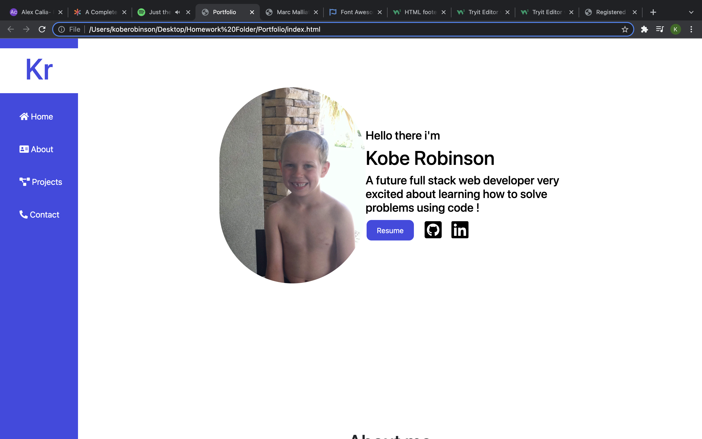

# Portfolio

## Overview
This assignment was given to us to show ourselves and our instructors just how much we have progressed in the course. I know for one that my first portfolio was terrible and now its slightly less terrible haha.

my motivation of this project was to create a portfolio that i wouldnt be embarrassed to show people

## Installation
Installation is simple just click the link and itll take you to my deployed webpage

## Credits
I worked on this project by myself

## link

Link to my portfolio: https://koberobinson.github.io/Portfolio/

Link to my Repository: https://github.com/koberobinson/Portfolio

## Screenshot

## License
MIT License

Copyright (c) [2021] [Kobe Robinson]

Permission is hereby granted, free of charge, to any person obtaining a copy
of this software and associated documentation files (the "Software"), to deal
in the Software without restriction, including without limitation the rights
to use, copy, modify, merge, publish, distribute, sublicense, and/or sell
copies of the Software, and to permit persons to whom the Software is
furnished to do so, subject to the following conditions:

The above copyright notice and this permission notice shall be included in all
copies or substantial portions of the Software